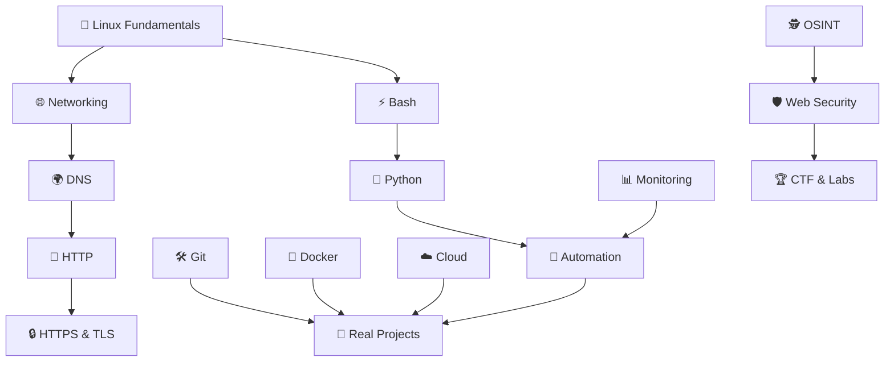
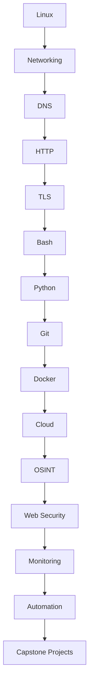
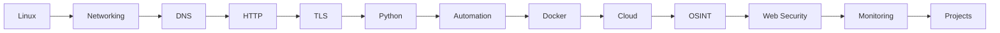
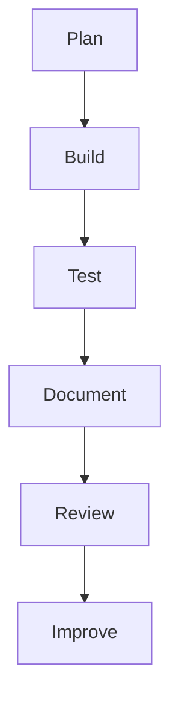

<div align="center">

# 🛡️ Kongali1720 Cybersecurity Roadmap

### *Learning • Building • Securing • Automating*

A complete learning roadmap for **Linux, Networking, DNS, HTTP, TLS, Python, Docker, Cloud, OSINT, Automation, and Web Security**.

---


---

## 🚀 My Learning Journey

</div>





```text
kongali1720-cybersecurity-roadmap/
│
├── README.md                  ⭐ Landing Page
├── LICENSE
├── .gitignore
├── CONTRIBUTING.md
│
├── docs/
│   ├── architecture.md
│   ├── roadmap.md
│   ├── glossary.md
│   ├── references.md
│   └── learning-path.md
│
├── 01-linux/
│   ├── README.md
│   ├── filesystem.md
│   ├── permissions.md
│   ├── process.md
│   ├── networking.md
│   ├── ssh.md
│   ├── services.md
│   ├── bash.md
│   ├── cheatsheet.md
│   └── labs.md
│
├── 02-network/
│   ├── README.md
│   ├── osi.md
│   ├── tcp-ip.md
│   ├── subnetting.md
│   ├── routing.md
│   ├── switching.md
│   ├── arp.md
│   ├── icmp.md
│   ├── ports.md
│   ├── wireshark.md
│   ├── tcpdump.md
│   ├── cheatsheet.md
│   └── labs.md
│
├── 03-dns/
│   ├── README.md
│   ├── a-record.md
│   ├── aaaa-record.md
│   ├── cname.md
│   ├── mx.md
│   ├── txt.md
│   ├── spf.md
│   ├── dkim.md
│   ├── dmarc.md
│   ├── dig.md
│   ├── host.md
│   ├── nslookup.md
│   ├── cheatsheet.md
│   └── labs.md
│
├── 04-http/
├── 05-tls/
├── 06-bash/
├── 07-python/
├── 08-git/
├── 09-docker/
├── 10-cloud/
├── 11-osint/
├── 12-security/
├── 13-monitoring/
├── 14-automation/
│
├── scripts/
│
├── labs/
│
└── assets/
```
---

# 📚 Repository Goals

This repository documents my cybersecurity learning journey through practical labs, notes, scripts, and projects.

Everything here is intended to strengthen my understanding of:

- Linux
- Networking
- DNS
- HTTP
- HTTPS
- TLS
- Python
- Git
- Docker
- Cloud Computing
- Web Security
- Automation
- Monitoring
- OSINT
- Bash Scripting

---

# 🗂 Repository Structure

```text
.
├── README.md
│
├── 01-linux
│
├── 02-network
│
├── 03-dns
│
├── 04-http
│
├── 05-tls
│
├── 06-bash
│
├── 07-python
│
├── 08-git
│
├── 09-docker
│
├── 10-cloud
│
├── 11-osint
│
├── 12-security
│
├── 13-monitoring
│
├── 14-automation
│
├── scripts
│
├── labs
│
└── resources
```

---

# 🎯 Learning Roadmap

## 🐧 Linux

- Filesystem
- Permissions
- Process Management
- Services
- Users
- SSH
- Cron
- Logging
- Networking Commands

---

## 🌐 Networking

- OSI Model
- TCP/IP
- Routing
- Switching
- VLAN
- Ports
- ICMP
- ARP
- IPv4
- IPv6

---

## 🌍 DNS

- A
- AAAA
- MX
- TXT
- SPF
- DKIM
- DMARC
- NS
- SOA
- CNAME
- TTL

---

## 📡 HTTP

- HTTP Methods
- Status Code
- Headers
- Cookies
- Sessions
- REST API

---

## 🔒 HTTPS & TLS

- SSL
- TLS
- Certificate
- SAN
- Handshake
- Cipher Suites
- HSTS

---

## ⚡ Bash

- Variables
- Loops
- Conditions
- Functions
- Automation Scripts

---

## 🐍 Python

- Variables
- Functions
- Classes
- JSON
- Requests
- Automation
- Networking

---

## 🐳 Docker

- Images
- Containers
- Networks
- Volumes
- Compose

---

## ☁️ Cloud

- Compute
- Storage
- DNS
- Firewall
- Load Balancer

---

## 🕵️ OSINT

- SpiderFoot
- WHOIS
- DNS Enumeration
- Certificate Transparency
- ASN
- Metadata

---

## 🛡️ Web Security

- Authentication
- Authorization
- Security Headers
- Sessions
- Logging
- Secure Configuration

---

## 📊 Monitoring

- Logs
- CPU
- RAM
- Disk
- Network
- Uptime

---

## 🤖 Automation

- Bash
- Python
- Cron
- CI/CD Basics

---

# 🧪 Labs

Every topic will include:

- Notes
- Hands-on Labs
- Screenshots
- Practice Commands
- Scripts
- Challenges

---

# 🛠️ Tools

| Category | Tools |
|----------|------|
| OS | Ubuntu / WSL |
| Version Control | Git |
| Container | Docker |
| Programming | Python |
| Shell | Bash |
| DNS | dig, host, nslookup |
| HTTP | curl |
| TLS | OpenSSL |
| OSINT | SpiderFoot |
| Monitoring | htop, ss |

---

# 📈 Progress

- [ ] Linux
- [ ] Networking
- [ ] DNS
- [ ] HTTP
- [ ] HTTPS
- [ ] TLS
- [ ] Bash
- [ ] Python
- [ ] Git
- [ ] Docker
- [ ] Cloud
- [ ] Monitoring
- [ ] Automation
- [ ] OSINT
- [ ] Web Security
- [ ] Labs
- [ ] Projects

---

# 💡 Philosophy

> Learn by understanding.
>
> Build by practicing.
>
> Improve by documenting.
>
> Share by contributing.

---

<div align="center">

### ⭐ If you find this repository useful, feel free to star it.

Made with ❤️ by **Kongali1720**

</div>

---


# 🛡️ Kongali1720 Security Engineering Handbook

> Enterprise-style learning handbook for Linux, Networking, DNS, HTTP, TLS, Python, Docker, Cloud, OSINT, Automation, and Security.

## Vision

Build practical engineering skills through documentation, labs, and projects.

## Roadmap



## Repository Layout

```text
01-linux/
02-network/
03-dns/
04-http/
05-tls/
06-python/
07-bash/
08-git/
09-docker/
10-cloud/
11-osint/
12-security/
13-monitoring/
14-automation/
labs/
scripts/
resources/
```

## Learning Tracks

### Linux
- Filesystem
- Permissions
- Processes
- Services
- SSH
- Logs
- Networking

### Networking
- OSI
- TCP/IP
- Routing
- Switching
- VLAN
- DNS
- IPv4/IPv6

### DNS
- A
- AAAA
- CNAME
- MX
- TXT
- SPF
- DKIM
- DMARC

### HTTP & TLS
- Requests
- Responses
- Headers
- Cookies
- TLS Handshake
- Certificates
- HSTS

### Python
- Fundamentals
- Requests
- JSON
- Automation
- CLI Tools

### Security
- Secure configuration
- Authentication
- Authorization
- Logging
- Threat modeling basics

## Engineering Principles

1. Learn by doing.
2. Document everything.
3. Automate repetitive work.
4. Validate assumptions.
5. Improve continuously.

## Lab Workflow



## Weekly Routine

| Day | Focus |
|---|---|
| Mon | Linux |
| Tue | Networking |
| Wed | DNS/TLS |
| Thu | Python |
| Fri | Docker |
| Sat | Security Lab |
| Sun | Documentation |

## Capstone Projects

- Personal server hardening
- DNS audit toolkit
- Certificate monitor
- Log analyzer
- Docker lab
- Python automation toolkit

## Progress

- [ ] Linux
- [ ] Networking
- [ ] DNS
- [ ] HTTP/TLS
- [ ] Python
- [ ] Docker
- [ ] Cloud
- [ ] OSINT
- [ ] Security
- [ ] Automation

---

<div align="center">


# 🌍 Digital Ecosystem


<table align="center">


<tr>
<th>Project</th>
<th>Status</th>
<th>Technology</th>
</tr>


<tr>
<td>
<a href="https://kongalicoin.id">
KongaliCoin ID
</a>
</td>

<td>🟢 Active</td>
<td>Ethereum Web3</td>

</tr>


<tr>
<td>
<a href="https://kongalicoin.com">
KongaliCoin COM
</a>
</td>

<td>🟢 Active</td>
<td>Smart Contract</td>

</tr>


<tr>
<td>
<a href="https://younext.cloud">
YOUNEXT Cloud
</a>
</td>

<td>🟢 Active</td>
<td>Cloud Security</td>

</tr>


<tr>
<td>
<a href="https://zlclothindustries.com">
ZLCLOTH Industries
</a>
</td>

<td>🟢 Active</td>
<td>Enterprise System</td>

</tr>


</table>


</div>


---

<div align="center">


# ⛓️ Blockchain Network


```text
Network    : Ethereum Mainnet
Standard   : ERC-20
Ticker     : KAC
Security   : Smart Contract Audited ✓
Consensus  : Proof of Stake
```


</div>


---

<div align="center">


# 📊 GitHub Analytics


</div>


---

<div align="center">


# 🤝 Collaboration


Open Collaboration:


🛡 Cyber Defense Research

🔐 Security Engineering

☁ Cloud Architecture

⛓ Blockchain Security

🚀 Open Source


⚠️ Research dilakukan secara legal dan mengikuti etika profesional.


</div>


---

<div align="center">


# ☕ Support Development


Jika project ini membantu kamu,
support kecil sangat berarti.


<a href="https://www.paypal.com/paypalme/bungtempong99/">


</a>


</div>


---

<div align="center">


# 💛 Human Mode


```text
"Mereka tidak berbeda.

Mereka mengajarkan arti cinta,
ketulusan dan kesabaran."
```


</div>


---

<div align="center">


# 🇮🇩 Gaspol Coding Squad Indonesia


> "Run it, understand it."


Focus:


🐍 Python Project

🛡 Security Tools

⚙ Automation

🏴 CTF Training

🔐 Secure Coding


</div>


---

<div align="center">


⭐ **Think Secure • Build Resilient • Protect Future** ⭐

Made with ❤️ by **Kongali1720**

</div>

<div align="center">
  
Made with ❤️ by **Kongali1720**

